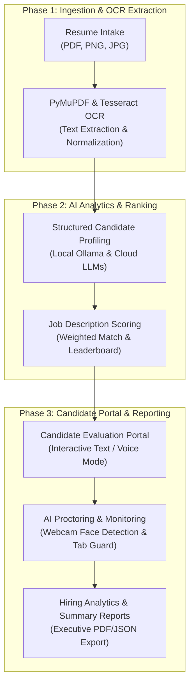
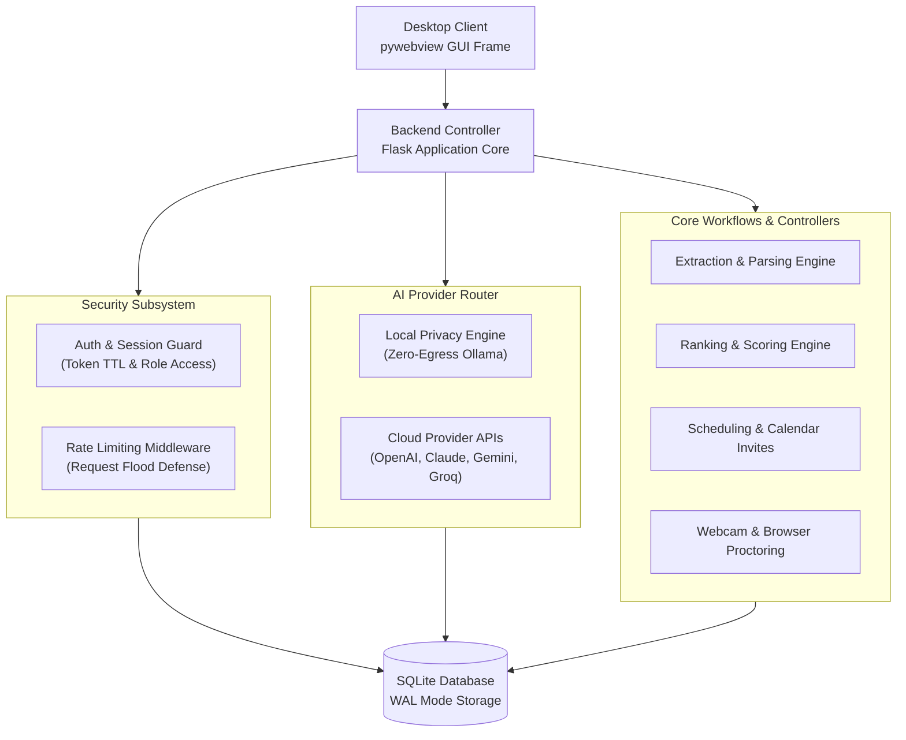

# AI Recruitment System

An enterprise-grade, offline-first desktop application for automating end-to-end recruitment pipelines—including resume intake, OCR text extraction, structured NLP candidate profiling, objective ranking, interview scheduling, interactive candidate evaluations, AI-assisted proctoring, and comprehensive analytics reporting.

Designed for privacy-conscious organizations, the application defaults to local zero-egress processing via Ollama while providing optional integration with enterprise cloud AI providers.

---

## Executive Summary

The AI Recruitment System transforms unstructured candidate applications into objective, structured hiring insights through an automated 6-stage pipeline.



---

## Key Capabilities

| Subsystem | Technical Implementation | Features |
| :--- | :--- | :--- |
| **Document Intake & OCR** | PyMuPDF, Tesseract OCR, OpenCV | Native PDF parsing, scanned image text extraction, auto-pre-flight validation |
| **NLP Profiling** | Local LLM (Ollama), OpenAI, Anthropic, Gemini, Groq, NVIDIA | Extraction of technical skills, experience, education, and match scores |
| **Objective Ranking** | Vector similarity & weighted scoring | Custom Job Description templates, automated candidate leaderboard generation |
| **Automated Scheduling** | Google Calendar API, iCalendar (.ics) | Slot management, automated invite delivery, candidate portal token assignment |
| **Candidate Portal** | Web-based secure interface | Token authentication, rate-limiting, interactive voice (Vosk/pyttsx3) or text mode |
| **AI Proctoring** | MediaPipe, OpenCV Haar Cascade | Real-time face detection, tab-switch detection, violation logging, report flags |
| **Persistence & Security** | SQLite (WAL mode), PBKDF2 hashing | Zero external network requirement in Privacy Mode, robust rate-limiting, session TTL |
| **Desktop Packaging** | PyInstaller, Inno Setup | Native Windows executable with embedded Python runtime and installer script |

---

## Application Architecture

The system operates as a hybrid desktop software combining a Flask application backend with a pywebview desktop frame.



---

## Quick Start Guide

### System Prerequisites
- Operating System: Windows 10 / Windows 11 (64-bit)
- Python Version: Python 3.10, 3.11, or 3.12
- Optional Local AI: [Ollama](https://ollama.ai/) installed with models (e.g., `llama3.2` or `mistral`)

### Installation Steps

1. Clone the repository:
   ```cmd
   git clone https://github.com/shrs425p/AI-Recruitment-System.git
   cd AI-Recruitment-System
   ```

2. Create and activate a virtual environment:
   ```cmd
   python -m venv venv
   call venv\Scripts\activate.bat
   ```

3. Install production dependencies:
   ```cmd
   pip install -r requirements.txt
   ```

4. Initialize speech recognition models (optional for offline voice mode):
   ```cmd
   python scripts\setup_vosk.py
   ```

5. Launch the application:
   ```cmd
   python main.py
   ```

---

## AI Provider Configuration

The application supports dual execution modes configured via the Settings menu or runtime environment:

### Privacy Mode (Default)
- **Engine**: Local Ollama instance
- **Network**: 100% offline zero-egress data processing
- **Default Models**: `llama3.2`, `mistral`, `gemma2`

### Cloud Mode
- **Engine**: Enterprise API integrations
- **Supported Providers**: OpenAI (GPT-4o), Anthropic (Claude 3.5), Google Gemini, Groq, NVIDIA API Catalog, OpenRouter
- **Configuration**: Managed securely in local runtime configuration (`%LOCALAPPDATA%\AI Recruitment System\config.py`)

---

## One-Click Automated Pipeline

The system features an automated pipeline execution engine that processes all uploaded candidate resumes sequentially:

1. **Extraction**: Converts PDF and image resumes to clean plain-text files.
2. **Structuring**: Executes LLM prompts to produce standardized JSON candidate profiles.
3. **Ranking**: Computes weighted match scores against target Job Descriptions.
4. **Scheduling**: Generates interview time slots and dispatchable candidate portal tokens.
5. **Reporting**: Compiles aggregate candidate pool metrics and shortlist recommendations.

---

## Development & Verification Suite

The repository includes a comprehensive testing and quality assurance suite.

### Running Automated Unit Tests
```cmd
venv\Scripts\python.exe -m pytest tests/ --timeout=60
```

### Static Type Analysis (Mypy)
```cmd
venv\Scripts\python.exe -m mypy app src tests main.py config.py
```

### Code Style & Formatting (Ruff)
```cmd
venv\Scripts\python.exe -m ruff check .
```

### Environment Diagnostic Pre-Flight
```cmd
venv\Scripts\python.exe scripts\verify_environment.py
```

---

## Desktop Packaging & Deployment

To compile a standalone Windows `.exe` installer:

```cmd
scripts\build_installer.bat
```

The installer compilation process generates:
- **Executable Bundle**: `dist\ARS\ARS.exe` via PyInstaller.
- **Windows Setup Installer**: `installer_output\AI_Recruitment_System_Setup_v1.0.0.exe` via Inno Setup.

---

## Security & Data Privacy Specifications

- **Zero Third-Party Telemetry**: Local database storage using SQLite WAL mode.
- **Candidate Token Isolation**: Cryptographically secure candidate portal tokens with configurable Session TTLs.
- **API Flood Protection**: Rate-limiting middleware enforcing strict request thresholds on external routes.
- **Proctoring Audit Trail**: Non-invasive browser tab monitoring and optional local webcam face presence verification logged locally per session.

---

## Documentation Directory

| Resource | Scope |
| :--- | :--- |
| [Documentation Index](docs/index.md) | Navigation overview by role |
| [Getting Started](docs/getting-started.md) | Installation, first run, and setup guide |
| [Pipeline Guide](docs/pipeline.md) | Stage-by-stage automated execution details |
| [Configuration](docs/configuration.md) | Settings, variables, and runtime paths |
| [Architecture](docs/architecture.md) | Internal modules, database schemas, and threading |
| [AI Providers](docs/ai-providers.md) | Ollama setup and cloud API integration |
| [Interview System](docs/interview-system.md) | Candidate portal, voice mode, and proctoring |
| [Google Calendar Integration](docs/google-calendar.md) | OAuth setup and invitation scheduling |
| [API Reference](docs/api-reference.md) | Flask endpoints and JSON schema specifications |
| [Build & Deploy](docs/build-and-deploy.md) | PyInstaller and Inno Setup release guide |
| [Theming System](docs/theming.md) | Customizing color palettes and dark mode |
| [Troubleshooting](docs/troubleshooting.md) | Diagnostics and common error resolutions |

---

## License

This project is licensed under the MIT License. See [LICENSE](LICENSE) for details.
