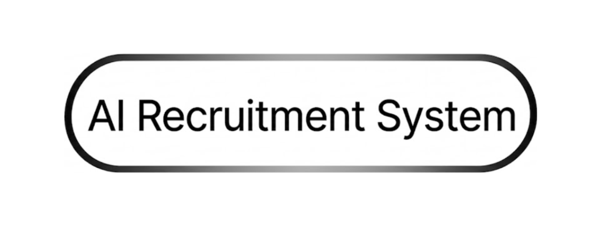

# AI Recruitment System: Autonomous Hiring Framework

<div align="center">
  
  
  <br>

  <h3>AI Recruitment System is a secure, automated AI pipeline for end-to-end technical hiring and proctored interviews.</h3>

  <p>
    <a href="docs/getting-started.md">Getting Started</a> | 
    <a href="docs/index.md">Documentation</a> | 
    <a href="https://github.com/shrs425p/AI-Recruitment-System">Follow @shrs425p (Creator)</a>
  </p>

  <p>
    
    
    
    
  </p>
  
  <p>
    
    
    
  </p>

  <br>

  <p>
    <b>Built With:</b><br>
    
    
    
    
    
  </p>
</div>

---

**AI Recruitment System** is a secure, end-to-end recruitment framework designed for automated resume extraction, AI-driven candidate ranking, and intelligent web-proctored interviewing. It integrates seamlessly with local privacy-focused LLMs (Ollama) and 8+ cloud providers, offering a comprehensive offline-first approach to technical hiring.

---

## Core Pillars & Unique Capabilities

| Automated Pipeline | Privacy & Security | Intelligent Proctoring |
| :--- | :--- | :--- |
| **NLP Feature Extraction**<br>Extracts structured data directly from Resumes, PNGs, and JPGs via PyMuPDF and embedded Tesseract OCR. | **Local Privacy Mode**<br>A fully offline pipeline utilizing local Ollama models. No data ever leaves the candidate's machine or your desktop. | **Webcam Liveness**<br>Tracks continuous face presence, multiple faces, and flags absences natively using MediaPipe and OpenCV Haar cascades. |
| **Job Description Ranking**<br>Dynamically scores candidates against specific job requirements using weighted matching across skills, domain, and experience. | **AES-Encrypted Vault**<br>Ensures that API keys and SMTP credentials are encrypted at rest using AES-Fernet and PBKDF2 key derivation. | **Browser Sandbox**<br>Tracks copy-paste attempts, tab-switching, and enforces a strict answer timeout protocol for interview integrity. |
| **Dynamic Cloud Router**<br>Load balances requests intelligently across OpenAI, Anthropic, Gemini, NVIDIA, and OpenRouter with real-time dynamic model fetching. | **Tokenized Isolation**<br>One-time use cryptographically generated UUID tokens for secure entry into the standalone Interview Portal. | **Offline Voice Mode**<br>Integrated HTML5 Web Speech STT & TTS capabilities for seamless verbal technical screenings. |

---


## Features

| Feature | Details |
|---|---|
| Resume Upload | PDF (digital + scanned), PNG, JPG |
| OCR | PyMuPDF for text PDFs, Tesseract OCR for scanned/image files |
| NLP Extraction | AI extracts: skills, experience, education, projects, certifications, domain |
| Candidate Ranking | 5-criterion weighted scoring (skills 35%, experience 20%, domain 20%, education 15%, certs 10%) |
| Scheduling | Top-N shortlist, HR slot coordination, `.ics` calendar files |
| Google Calendar | Optional OAuth integration for automatic invite creation |
| Interview Portal | Token-authenticated HTTPS portal for candidates |
| Voice Mode | Offline speech-to-text (Vosk) + text-to-speech (pyttsx3) |
| Webcam Proctoring | Face detection via MediaPipe (fallback: OpenCV Haar cascade) |
| Violation Tracking | Tab switches, copy-paste, face absence, multiple faces |
| PDF Reports | Interview transcript + scores + proctoring summary |
| Multi-Provider AI | 8 cloud providers + local Ollama, with round-robin load balancing |
| Privacy Mode | Fully offline — all AI runs locally via Ollama |
| Encrypted Storage | API keys encrypted at rest (AES-Fernet + PBKDF2) |
| Email Notifications | SMTP scheduling emails with customisable templates |

---

## Quick Start

### Requirements
- Windows 10 / 11 (64-bit)
- Python 3.10 or 3.11
- Optional: [Ollama](https://ollama.com) for local AI (Privacy mode)

### Installation

```bash
git clone https://github.com/shrs425p/AI-Recruitment-System.git
cd AI-Recruitment-System

python -m venv venv
venv\Scripts\activate

pip install -r requirements.txt
```

### Verify environment

```bash
python scripts\verify_environment.py
```

### Run

```bash
python main.py
```

The app opens a desktop window. The candidate interview portal runs at `https://<your-ip>:5000`.

---

## AI Providers

**Privacy mode** (offline) — all AI calls go to a local Ollama server. No data leaves the machine.

```bash
# Install Ollama from https://ollama.com
ollama pull llama3.2:3b
```

**Cloud mode** — supports 8 providers with round-robin load balancing:

| Provider | Free Tier | Default Model |
|---|---|---|
| NVIDIA NIM | Yes | `meta/llama-3.1-8b-instruct` |
| Groq | Yes | `llama3-8b-8192` |
| OpenRouter | Some models | `meta-llama/llama-3.1-8b-instruct:free` |
| Gemini | Yes | `gemini-1.5-flash` |
| Anthropic | Paid only | `claude-3-5-haiku-latest` |
| OpenAI | Paid only | `gpt-4o-mini` |
| GitHub Models | Yes | `gpt-4o-mini` |
| Ollama Cloud | Paid only | `llama3.2:3b` |

Configure providers in Settings → AI Providers after launching the app.

---

## Building an Installer

Requires [Inno Setup 6](https://jrsoftware.org/isdl.php) installed.

```bash
scripts\build_installer.bat
```

Produces:
- `dist\ARS\ARS.exe` — portable executable
- `installer_output\ARS_Setup_1.0.exe` — Windows installer

---

## Running Tests

```bash
pytest
pytest -v                         # verbose
pytest tests/test_features.py    # specific file
```

---

## Documentation

| Doc | What it covers |
|---|---|
| [Getting Started](docs/getting-started.md) | Installation, first run, environment variables |
| [Architecture](docs/architecture.md) | Two-server model, data flow, component map |
| [Pipeline](docs/pipeline.md) | Step-by-step walkthrough of all 7 stages |
| [Configuration](docs/configuration.md) | Every config setting and default value |
| [AI Providers](docs/ai-providers.md) | Cloud vs Privacy mode, setup for each provider |
| [Interview System](docs/interview-system.md) | Tokens, question generation, voice mode, proctoring |
| [API Reference](docs/api-reference.md) | All HTTP routes with request/response shapes |
| [Security](docs/security.md) | Auth, encryption, HTTPS, rate limiting, sessions |
| [Google Calendar](docs/google-calendar.md) | OAuth setup and calendar integration |
| [Email Setup](docs/email-setup.md) | SMTP configuration and email templates |
| [Data Formats](docs/data-formats.md) | JSON schemas for all output files |
| [Customization](docs/customization.md) | Tunable parameters (scoring weights, question count, etc.) |
| [Reports](docs/reports.md) | What interview reports contain and how to read them |
| [Data Management](docs/data-management.md) | Backup, restore, clearing data |
| [Deployment](docs/deployment.md) | Building the installer, installing on another machine |
| [Testing](docs/testing.md) | Running tests, what each test covers, writing new tests |
| [FAQ](docs/faq.md) | Common questions |
| [Troubleshooting](docs/troubleshooting.md) | Common errors and fixes |
| [Contributing](docs/contributing.md) | Code structure, conventions, adding features |

---

## Project Structure

```
AI-Recruitment-System/
├── main.py                 ← Entry point
├── app/                    ← Flask app (routes, templates, static)
├── src/                    ← Business logic (NLP, ranking, interview, proctoring...)
├── config/                 ← Database-backed dynamic config
├── models/                 ← Bundled Tesseract OCR + Vosk speech model
├── scripts/                ← Build, verify, and utility scripts
├── tests/                  ← pytest test suite
└── docs/                   ← Documentation
```

---

## License

MIT License — see [LICENSE](LICENSE) for details.


