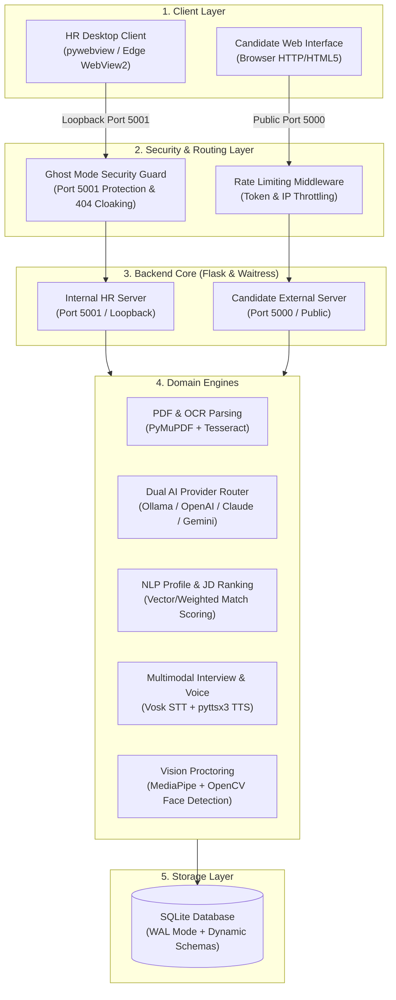
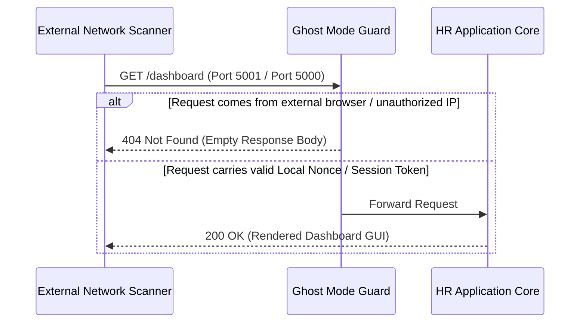
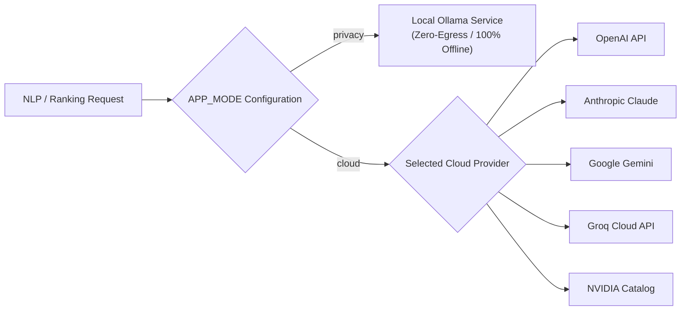

# AI Recruitment System — Technology Stack & System Architecture

An exhaustive technical breakdown of the architecture, dependencies, frameworks, algorithms, and security patterns underpinning the **AI Recruitment System**.

---

## 1. Executive Technical Summary

The **AI Recruitment System** is an enterprise-grade, privacy-first desktop & server application designed to automate end-to-end talent acquisition pipelines. Operating on a **hybrid dual-server architecture**, the platform handles resume parsing, OCR text extraction, candidate profiling, objective leaderboard ranking, automated calendar scheduling, multimodal interview evaluation, real-time proctoring, and executive PDF reporting.



---

## 2. Comprehensive Technology Stack Matrix

| Subsystem / Layer | Technology / Library | Version / Target | Primary Role & Implementation Details |
| :--- | :--- | :--- | :--- |
| **Language Runtime** | **Python** | `3.10` - `3.12` | Core backend logic, async worker orchestration, CLI commands, and AI routing. |
| **Web Framework** | **Flask** | `>= 3.0` | Modular application core utilizing Blueprints (`auth`, `dashboard`, `interview`, `nlp`, `ranking`, `reports`, `scheduling`, `settings`, `upload`). |
| **WSGI Server** | **Waitress** | `>= 3.0` | Multi-threaded production WSGI server powering concurrent HTTP operations on Windows without external Nginx dependencies. |
| **Desktop GUI Host** | **pywebview** | `>= 5.0` | Embeds Microsoft Edge WebView2 rendering engine to present HTML5/JS dynamic interfaces inside a desktop window shell. |
| **PDF Extraction** | **PyMuPDF (`fitz`)** | `>= 1.23` | High-performance C-backed native text, table, and metadata extraction from PDF candidate resumes. |
| **OCR Engine** | **Tesseract OCR / pytesseract** | `>= 0.3.10` | Optical character recognition engine for scanned image resumes, standardizing text inputs. |
| **Image Processing** | **Pillow & OpenCV** | `Pillow >= 10.0`, `opencv-python >= 4.9` | Image preprocessing (grayscale, thresholding, deskewing) prior to OCR and image proctoring frame rendering. |
| **Local AI Engine** | **Ollama Client** | `>= 0.1.7` | Zero-egress local LLM inference client (`llama3.2`, `mistral`, `gemma2`) running entirely offline. |
| **Cloud AI Providers** | **OpenAI, Anthropic, Gemini, Groq, NVIDIA, OpenRouter** | Official SDKs & REST APIs | Optional enterprise cloud LLM integrations managed dynamically through `src/provider_router.py`. |
| **Speech Recognition (STT)** | **Vosk** | `>= 0.3` | Offline lightweight acoustic speech-to-text recognition model (`vosk-model-small-en-in-0.4`) executing locally. |
| **Speech Synthesis (TTS)** | **pyttsx3** | `>= 2.90` | Offline text-to-speech audio synthesis engine for candidate interview question vocalization. |
| **Computer Vision Proctoring** | **MediaPipe & OpenCV** | `mediapipe >= 0.10.9` | Real-time face detection, head pose estimation, multi-face warning triggers, and candidate session logging. |
| **Calendar Integration** | **Google Calendar API & iCalendar** | `google-api-python-client >= 2.100`, `icalendar >= 5.0` | Automated slot booking, Google Calendar event creation, OAuth2 flow, and standard `.ics` invite file compilation. |
| **PDF Generation** | **FPDF2** | `>= 2.7` | Standalone PDF report generation for candidate summary cards, leaderboard exports, and interview evaluation dossiers. |
| **Database Engine** | **SQLite3** | Native (WAL Mode) | Thread-safe local relational storage operating with Write-Ahead Logging (WAL) for high concurrency and zero setup. |
| **Cryptography & Security** | **Cryptography & PyOpenSSL** | `cryptography >= 42.0`, `pyopenssl >= 24.0` | PBKDF2 key derivation password hashing, secure token generation, and local credential encryption. |
| **Desktop Packaging** | **PyInstaller & Inno Setup** | `PyInstaller >= 6.0`, `Inno Setup 6` | Windows executable compilation (`dist/ARS/ARS.exe`) and single-file setup installer builder (`AI_Recruitment_System_Setup_v1.0.0.exe`). |
| **QA / Testing** | **pytest, Ruff, Mypy** | `pytest >= 8.0`, `ruff >= 0.3` | Automated unit testing, code quality formatting/linting, and static type checking. |

---

## 3. Subsystem Architecture & Technical Deep Dives

### 3.1 Dual-Server Architecture & Ghost Mode Protection
To preserve privacy while enabling remote candidate participation, the system initializes two server instances bound to distinct network interfaces:
1. **Internal HR Server (Port 5001)**: Bound exclusively to `127.0.0.1`. Hosts administrative routes, resume intake controls, JD configuration, scoring algorithms, and security settings. Interfaced via `pywebview`.
2. **External Candidate Server (Port 5000)**: Bound to local network interfaces (`0.0.0.0` or LAN IP). Hosts candidate assessment portals, webcam proctoring listeners, and token verification routes.
3. **Ghost Mode Security Guard**: Middleware intercepting incoming HTTP requests. If an external client requests an HR route or unauthenticated administrative path, the server returns a stealth blank HTTP 404 response to cloak internal infrastructure.



---

### 3.2 Ingestion & OCR Extraction Engine (`src/pdf_to_txt.py`)
- **Native PDF Ingestion**: Evaluates file signatures (`%PDF-`). Utilizes PyMuPDF (`fitz`) to extract structured text blocks, preserving layout semantics.
- **Scanned Document OCR**: If raw text yield is below threshold (e.g., image-only PDFs or image uploads `.png`/`.jpg`), PyMuPDF renders page bitmaps to PIL images.
- **Image Preprocessing**: Passes images through OpenCV filters (grayscale conversion, Otsu binarization, noise reduction) before handing frames to `pytesseract`.
- **Text Normalization**: Strips control characters, normalizes whitespace, and handles multi-column layouts into standardized UTF-8 `.txt` documents.

---

### 3.3 Dual-Engine AI Routing (`src/provider_router.py` & `src/ai_mode.py`)
The system features a decoupled abstraction layer supporting two operational modes:
- **Privacy Mode (Default)**: Redirects all LLM requests to a local [Ollama](https://ollama.ai/) instance over HTTP (`http://localhost:11434`). Guarantees zero network egress and full GDPR/data sovereignty compliance. Supported models: `llama3.2`, `mistral`, `gemma2`.
- **Cloud Mode**: Connects directly to external LLM provider APIs via unified wrapper adapters.
  - **OpenAI**: `gpt-4o`, `gpt-4o-mini`
  - **Anthropic**: `claude-3-5-sonnet`, `claude-3-5-haiku`
  - **Google**: `gemini-1.5-flash`, `gemini-1.5-pro`
  - **Groq**: Low-latency inference (`llama-3.1-70b`, `mixtral-8x7b`)
  - **NVIDIA AI Foundation**: Open-spec catalog endpoints
  - **OpenRouter**: Unified provider API bridge
- **Automatic Fallback & Retry**: Implements exponential backoff (`AI_RETRY_ATTEMPTS = 3`, `AI_RETRY_BACKOFF = 2`) for transient API failures.



---

### 3.4 Candidate Profiling & Objective Ranking Engine (`src/nlp_extractor.py`, `src/ranking_engine.py`)
1. **NLP Structuring**: Sends raw resume text to the configured AI engine with JSON schema enforcement. Extracts:
   - Contact info (Name, Email, Phone, Location)
   - Hard Technical Skills & Soft Skills
   - Total Work Experience (Years) & Roles
   - Educational Qualifications & Certifications
2. **Weighted Scoring Algorithm**: Computes multi-dimensional compatibility scores against defined Job Descriptions:
   $$\text{Overall Score} = (W_{\text{skills}} \times S_{\text{skills}}) + (W_{\text{exp}} \times S_{\text{exp}}) + (W_{\text{edu}} \times S_{\text{edu}}) + (W_{\text{domain}} \times S_{\text{domain}})$$
3. **Leaderboard Generation**: Sorts candidates into ranked leaderboards, assigning categorization tiers (*Shortlisted*, *Under Review*, *Rejected*).

---

### 3.5 Multimodal Interview Portal & Proctoring (`src/interview_bot.py`, `src/webcam_proctor.py`, `src/voice_interview.py`)
- **Interactive Technical Interview**: AI bot generates adaptive technical/behavioral interview questions based on candidate resume weaknesses and job description criteria.
- **Offline Speech-to-Text (STT)**: Utilizes Vosk (`vosk-model-small-en-in-0.4`) for local candidate voice transcriptions without cloud API keys.
- **Offline Text-to-Speech (TTS)**: `pyttsx3` reads interview questions aloud to candidates.
- **Computer Vision Proctoring**:
  - Uses MediaPipe Face Mesh & OpenCV to monitor candidate webcam stream during assessments.
  - Detects head turning, multiple faces present, or candidate leaving the frame.
- **Browser Tab Guard**: HTML5 Page Visibility API captures tab-switch events and window focus losses, writing timestamped audit entries directly to SQLite.

---

### 3.6 Persistence & Security Infrastructure (`app/database.py`, `app/rate_limiter.py`)
- **SQLite WAL Mode**: Operating with Write-Ahead Logging (`PRAGMA journal_mode=WAL;`), enabling concurrent readers and writers without database locking errors.
- **Dynamic Migration Engine**: Automatically inspects table columns on application boot and applies missing column updates seamlessly without data loss.
- **Token Security & Rate Limiting**:
  - Candidate session tokens generated via `secrets.token_urlsafe(32)`.
  - HR passwords secured via `PBKDF2-HMAC-SHA256` with unique 16-byte random salts.
  - Custom in-memory rate-limiting middleware (`RateLimiter`) blocks IP request floods on candidate portal endpoints.

---

### 3.7 Desktop Packaging & Deployment Engine (`scripts/build_installer.bat`)
- **PyInstaller Bundling**: Compiles application assets, Python interpreter, native C binaries (OpenCV, Tesseract DLLs, PyMuPDF shared libraries) into `dist/ARS/`.
- **Inno Setup Packaging**: Inno Setup script wraps the output directory into a native Windows Setup installer (`AI_Recruitment_System_Setup_v1.0.0.exe`).
- **Silent Script Launcher**: `Start.vbs` executes the underlying Python process seamlessly in background mode without leaving open Windows console windows.

---

## 4. Directory & Module Blueprint

```
AI-Recruitment-System/
├── app/                        # Flask Web Backend & GUI Routes
│   ├── routes/                 # Blueprint Route Handlers
│   │   ├── auth.py             # Login, Session & Nonce Verification
│   │   ├── dashboard.py        # Candidate & Pipeline Management UI
│   │   ├── interview.py        # Assessment Portal & Proctoring Endpoints
│   │   ├── nlp.py              # Resume Extraction API
│   │   ├── ranking.py          # Job Description & Scoring API
│   │   ├── reports.py          # Executive Summary & PDF Generators
│   │   ├── scheduling.py       # Calendar Invite Dispatch
│   │   ├── settings.py         # AI Model & System Configuration
│   │   └── upload.py           # Multi-file Resume Intake Handler
│   ├── core.py                 # Application Factory & Multi-Port Server Setup
│   ├── database.py             # SQLite WAL Persistence & Schema Migration
│   ├── rate_limiter.py         # Request Throttling Middleware
│   └── folder_opener.py        # Native Windows File Explorer Interop
├── src/                        # Domain Processing Modules & Core Engines
│   ├── ai_mode.py              # Privacy vs. Cloud Mode State Management
│   ├── provider_router.py      # Unified Multi-LLM API Router
│   ├── pdf_to_txt.py           # PyMuPDF & Tesseract OCR Extractor
│   ├── nlp_extractor.py        # Resume Text to JSON Structuring Engine
│   ├── ranking_engine.py       # Weighted JD Candidate Scoring
│   ├── interview_bot.py        # AI Technical Interview Question Generator
│   ├── voice_interview.py      # Vosk STT & pyttsx3 Audio Handlers
│   ├── webcam_proctor.py       # MediaPipe / OpenCV Vision Proctoring
│   ├── scheduling.py           # Slot Assignment Engine
│   ├── google_calendar.py      # Google OAuth2 & Calendar API Interop
│   ├── email_sender.py         # SMTP Invite Delivery
│   └── report_generator.py     # FPDF2 Executive Summary Generator
├── config/                     # Configuration Management
│   └── config.py               # Runtime Settings & API Key Registry
├── models/                     # Offline AI & Machine Learning Assets
│   ├── Tesseract-OCR/          # Bundled Windows Tesseract Binaries
│   └── vosk-model-small-en-in-0.4/ # Offline Speech Recognition Model
├── scripts/                    # Deployment, Testing & Setup Utilities
│   ├── build_installer.bat     # PyInstaller + Inno Setup Compilation
│   ├── setup_vosk.py           # Vosk Speech Model Installer
│   ├── verify_environment.py   # Pre-Flight Diagnostic Checker
│   └── generate_resumes.py     # Mock Candidate Data Generator
├── tests/                      # Automated Verification Test Suite
├── main.py                     # Main Desktop Entry point & pywebview GUI Host
├── pyproject.toml              # Build Metadata, Ruff & Mypy Specs
├── requirements.txt            # Python Dependency Manifest
└── README.md                   # System Overview & Usage Guide
```

---

## 5. Verification & Quality Assurance Protocols

The repository enforces strict pre-commit and build-time verification commands:

```cmd
:: 1. Run Automated Unit & Integration Tests
venv\Scripts\python.exe -m pytest tests/ --timeout=60

:: 2. Execute Code Format & Linting Checks
venv\Scripts\python.exe -m ruff check .

:: 3. Static Type Consistency Analysis
venv\Scripts\python.exe -m mypy app src tests main.py

:: 4. Verify Local System Dependencies & Pre-flight Diagnostics
venv\Scripts\python.exe scripts\verify_environment.py
```

---
*Documented for AI Recruitment System v1.0.0*
